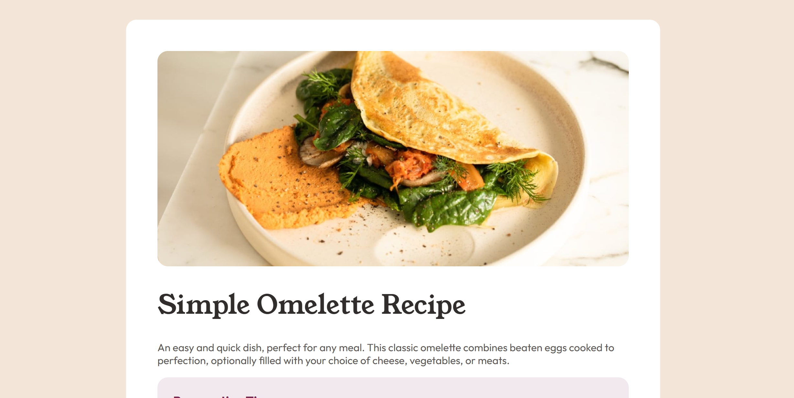

# Frontend Mentor - Recipe page solution

This is a solution to the [Recipe page challenge on Frontend Mentor](https://www.frontendmentor.io/challenges/recipe-page-KiTsR8QQKm). Frontend Mentor challenges help you improve your coding skills by building realistic projects. 

## Table of contents

- [Overview](#overview)
  - [The challenge](#the-challenge)
  - [Screenshot](#screenshot)
  - [Links](#links)
- [My process](#my-process)
  - [Built with](#built-with)
  - [What I learned](#what-i-learned)

## Overview

### Screenshot



### Links

- Solution URL: [https://github.com/hrong1/Recipe-page](https://github.com/hrong1/Recipe-page)
- Live Site URL: [https://hrong1.github.io/Recipe-page/](https://hrong1.github.io/Recipe-page/)

## My process

### Built with

- Semantic HTML5 markup
- CSS custom properties
- Flexbox

### What I learned

Getting understand to use lists and table in css and html

```html
<table class="nutrition-table">
    <tr class="nutrition-row">
        <th class="nutrition-label" scope="row">Calories</th>
        <td class="nutrition-value" >277kcal</td>
    </tr>
    <tr class="nutrition-row">
         <th class="nutrition-label" scope="row">Carbs</th>
        <td class="nutrition-value">0g</td>
    </tr>
    <tr class="nutrition-row">
        <th class="nutrition-label" scope="row">Protein</th>
        <td class="nutrition-value">20g</td>
    </tr>
    <tr class="nutrition-row">
        <th class="nutrition-label" scope="row">Fat</th>
        <td class="nutrition-value">22g</td>
    </tr>
</table>
```
```css
.ingredients-list li {
    padding-left: 2rem;
    margin-top: 1rem;
    margin-left: 0;
    list-style-type: square;
}
```


